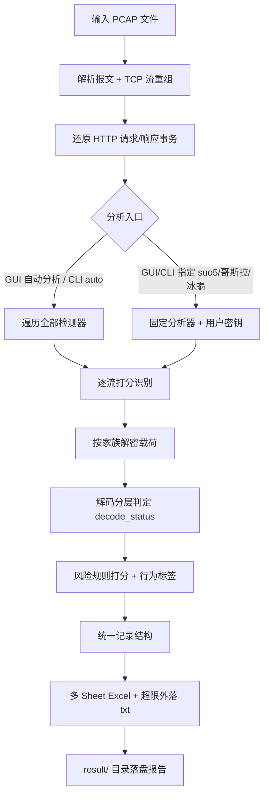
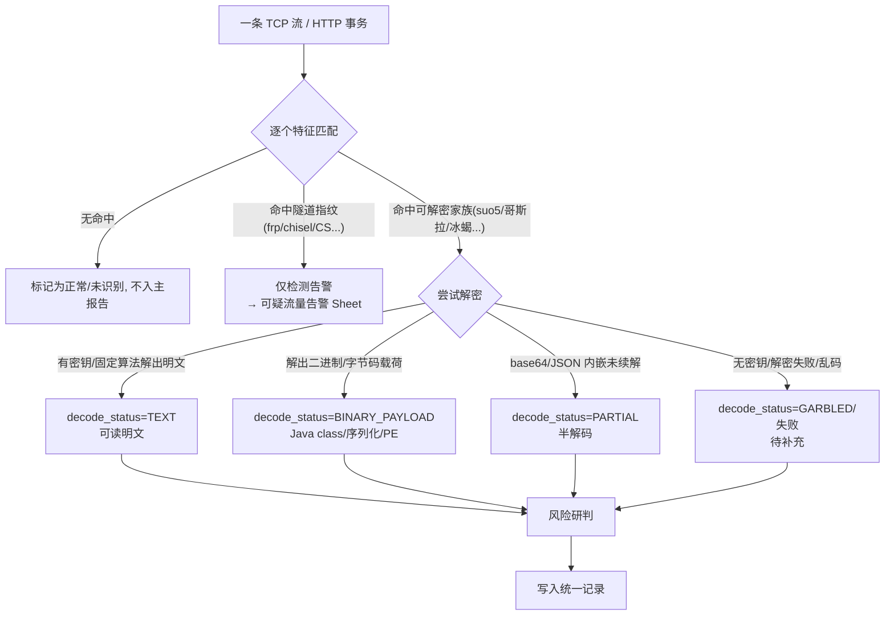
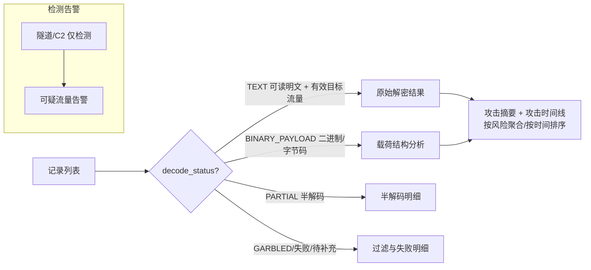
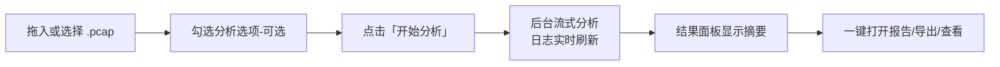
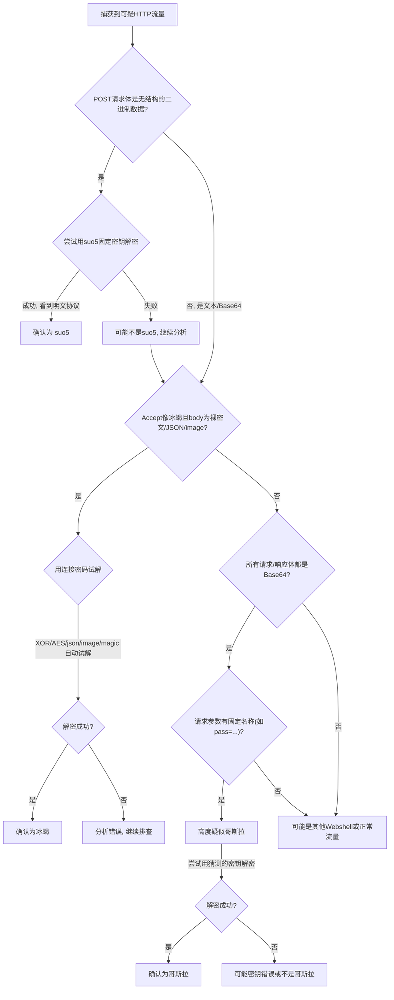

# Webshell 流量分析工具 · V3.0

一个图形化 / 命令行流量分析工具，用于**应急取证场景下快速解密与研判常见 WebShell 与隧道代理流量**。

核心解密覆盖 **suo5、哥斯拉（Godzilla）、冰蝎（Behinder）/ 旧 Rebeyond**；自动分析还可识别 / 半解 **中国菜刀、蚁剑、Weevely、reGeorg / Neo-reGeorg**，通用 Web 漏洞利用与写马（Log4Shell、ThinkPHP、SQLi 写马、脚本上传等），以及 **FRP、NPS、Chisel、FastTunnel、Venom、Stowaway、SOCKS、Lanproxy、Termite、VSCode / Cloudflare Tunnel、Cobalt Strike、Meterpreter** 等隧道 / C2 工具（详见文末[检测能力矩阵](#八检测能力矩阵)）。

> **本仓库仅提供开箱即用的可执行文件（见 [Releases](../../releases)），不含源码。** 下载对应平台的压缩包，解压即用，无需安装 Python 或任何依赖。

> **V3.0 新增**：两个独立工具页——**「编码/解码工具」**（Base64/Base64-URL/Hex/URL/Gzip/Zlib/ROT13/XOR）与**「对称加解密」**（AES/DES/3DES/**SM4 国密** × ECB/CBC/CFB/OFB/CTR/GCM 全模式）；引擎**线程安全**、**内存软上限**防超大抓包 OOM。
>
> **V2.0 基础**：GUI / CLI **统一内核**（同源引擎，报告字段一致）；suo5 **双重 / 嵌套隧道**分层还原；完整解密内容**直接入 Excel 不截断**，仅在超过 Excel 单元格 32767 字符硬上限时**自动外落 `.txt` 并在单元格标注路径**；GUI 分析完成后报告**自动落盘**到 `result/`。

---

## 目录

1. [下载与使用](#一下载与使用)
2. [后端引擎工作原理（流程图）](#二后端引擎工作原理流程图)
3. [GUI 功能面板详解](#三gui-功能面板详解)
4. [命令行（CLI）用法](#四命令行cli用法)
5. [分析报告结构](#五分析报告结构)
6. [实战：如何识别并解密未知 WebShell 流量](#六实战如何识别并解密未知-webshell-流量)
7. [核心解密对象技术原理](#七核心解密对象技术原理)
8. [检测能力矩阵](#八检测能力矩阵)

---

## 一、下载与使用

前往 [Releases](../../releases) 下载对应平台的压缩包，解压后即可运行，**无需安装 Python 或任何依赖**。每个平台提供两个包：图形界面版 `Webshell-Analyzer` 与命令行版 `wsa-cli`。

| 平台 | 架构 | 图形界面 | 命令行 |
|------|------|----------|--------|
| Windows | x86_64 / ARM64 | `Webshell-Analyzer-*-windows-*.zip` | `wsa-cli-*-windows-*.zip` |
| Linux | x86_64 / ARM64 | `Webshell-Analyzer-*-linux-*.zip` | `wsa-cli-*-linux-*.zip` |
| macOS | Intel / Apple Silicon | `Webshell-Analyzer-*-macos-*.zip` | `wsa-cli-*-macos-*.zip` |

**运行说明：**

- **Windows**：解压后双击图形界面可执行文件；命令行版在终端运行。
- **Linux**：图形界面需系统含 Tk（Debian/Ubuntu：`sudo apt install python3-tk`）；命令行版 `chmod +x` 后运行。
- **macOS**：首次运行如被 Gatekeeper 拦截，在「系统设置 → 隐私与安全性」放行，或执行 `xattr -dr com.apple.quarantine <解压后的路径>`。

**最简单的一次分析**：打开图形界面 → 「自动分析」标签页 → 拖入 `.pcap` → 点「开始分析」→ 报告自动保存到 `result/` 并在结果面板一键打开。无需任何密钥，自动识别 PCAP 中的 webshell / 隧道类型。

---

## 二、后端引擎工作原理（流程图）

**GUI 的每个分析面板、CLI 的每个子命令，最终都调用同一套引擎。** 手工入口（suo5 / 哥斯拉 / 冰蝎面板）只是「固定分析器 + 用户提供的密钥」，与全自动分析共用同源逻辑，输出报告字段、风险等级、乱码分层、时间线、过滤明细完全一致。

### 2.1 端到端总流程



### 2.2 单条流量的识别与解密



### 2.3 解码分层 → Excel Sheet 路由

引擎按 `decode_status` 把每条记录分流到不同 Sheet，做到「结论优先、明细可查、乱码不混入主结果」：



### 2.4 内容外落机制

完整解密内容**直接写入 Excel 单元格，绝不人为截断**。仅当单条内容超过 Excel 规范的 **32767 字符硬上限**时：

- 完整内容外落为 `.txt`，存到 **Excel 同级、以 Excel 文件名命名的目录**（如 `result/报告.xlsx` → `result/报告/cell_0001.txt`）；
- 单元格头部标注 `[超过 Excel 单元格上限 32767 字符，完整内容(共 N 字符)已保存至: 报告/cell_0001.txt]`，其后仍保留尽量多的内容前缀；
- 标注为**相对 Excel 所在目录的路径**，整个目录搬走/打包后仍有效；GUI 的「导出报告副本 / 导出分析包」会连同外落目录一并复制 / 打包。

---

## 三、GUI 功能面板详解

启动图形界面可执行文件后，界面顶部为标签页，顺序为：**自动分析 → suo5 → 哥斯拉 → 冰蝎**（每类含「PCAP 分析」与「载荷解密」两种）**→ 编码/解码工具 → 对称加解密**。

### 3.1 自动分析（推荐首选，无需密钥）

> 一次性识别 PCAP 中所有支持的 webshell / 隧道类型，自动解密 / 检测并导出合并报告。

**操作流程：**



1. 拖拽或点「选择文件…」载入 `.pcap`（逐包流式读取；TCP 流重组需将载荷留在内存归并，设有 ~1.5GB 内存软上限，超过则只分析已读入部分并告警，超大抓包建议先按 IP/端口/时间切分）。
2. 可选「分析选项」：
   - **启用风险规则分析**：对解密内容跑风险规则打分并标注行为标签（默认开）。
   - **输出过滤/失败明细**：是否输出「过滤与失败明细」Sheet。
   - **仅导出中高危**：「原始解密结果」只保留中/高危记录。
   - **敏感字段脱敏**：对 `password/key/token` 等键后的值打码。
3. 点「开始分析」，日志区实时输出；可随时「取消分析」。
4. 完成后**报告自动保存到 `result/`**，文件名形如 `<类型>_<pcap名>_<时间戳>.xlsx`，并在下方「分析结果」面板显示摘要与操作按钮（见 [3.7](#37-分析结果面板所有-pcap-分析面板共用)）。

### 3.2 suo5 分析

- **suo5 PCAP 分析**：拖入 / 选择 `.pcap` → 「开始分析」。自动提取 suo5 的 HTTP 隧道流量，分层还原**外层 / 内层隧道、连接目标 `h:p`、内层协议（SSH/RDP/HTTP/TLS/SOCKS…）**，支持**嵌套 / 双重 suo5**。无需提供密钥（suo5 为固定算法）。
- **suo5 载荷解密**：把从流量里复制的十六进制（Hex）加密载荷粘进输入框 → 「解密」→ 下方即时显示明文。

### 3.3 哥斯拉（Godzilla）分析

- **哥斯拉 PCAP 分析**：需填写 **连接密码（Key，必填）**、**Webshell URI（必填，如 `/shell.jsp`）**，加密器类型保留兼容旧界面（实际自动判定 AES/XOR、raw/base64、C#/ASP/ASMX 变体）→ 「开始分析」。
- **哥斯拉载荷解密**：输入密钥字符串（默认常见 `key`）+ 加密载荷（参数体 / Base64 / raw/hex / ASMX 片段）→ 「解密」。EVAL 类型需粘贴完整 POST 体（如 `pass=...&o=...`）。

### 3.4 冰蝎（Behinder）分析

- **冰蝎 PCAP 分析**：需填写 **连接密码（必填，默认常见 `rebeyond`）**，工具自动派生 16 字节 key 并识别 XOR/AES、raw/base64/JSON/image/AES_WITH_MAGIC 传输 → 「开始分析」。
- **冰蝎载荷解密**：输入连接密码 + 加密载荷（raw/base64/hex/json/image）→ 「解密」。

### 3.5 编码/解码工具（通用，无需密钥）

> 独立功能页，用于 webshell 与隧道流量常见「传输层编码/混淆」的手工正反转换——不是家族密钥解密（那走上面各家族的「载荷解密」页），而是各工具承载指令/载荷时叠加的可逆编码。

- **支持的编码类型**：`Base64`、`Base64-URL`（suo5 v2 marshalBase64）、`Hex`、`URL`（Log4Shell/ThinkPHP 等 payload）、`Gzip`（哥斯拉）、`Zlib/Deflate`（weevely gzinflate）、`ROT13`（weevely str_rot13）、`XOR`（通用重复密钥，密钥可填 hex 如 `0x42` 或直接文本）。
- **用法**：输入框粘贴内容 → 选「编码类型」→ 点 **[编码]** 或 **[解码]** → 下方输出。
- **贴心处理**：解码时二进制输入可为 **base64 或 hex**（自动识别，纯 hex 优先）；`Gzip/Zlib/XOR` 的二进制结果同时以 **hex + base64** 两种形式展示；base64 缺 `=` 填充也能解。
- **链式解码**：多层编码（如 base64 套 gzip）点 **[输出→输入]** 把结果灌回输入，逐层剥离。

### 3.6 对称加解密（AES / DES / 3DES / SM4）

> 独立功能页，用于分析时手工做分组密码的加解密——覆盖 webshell/隧道流量里可能遇到的对称算法与各种工作模式。

- **算法**：`AES`（128/192/256）、`DES`、`3DES`、`SM4`（国密 GB/T 32907，内置实现、已用官方向量校验，无需额外依赖）。
- **模式**：`ECB` / `CBC` / `CFB` / `OFB` / `CTR`，AES 额外支持 `GCM`（认证加密）。
- **填充**：`PKCS7` / `Zero` / `None`（仅 ECB/CBC 生效；流式模式 CFB/OFB/CTR/GCM 不填充）。
- **参数编码**：密钥、IV/Nonce 均可按 `文本(UTF-8)` / `Hex` / `Base64` 解释；密文（加密输出/解密输入）可选 `Base64` / `Hex`。
- **用法**：选算法/模式/填充 → 填密钥与 IV（ECB 无需 IV；CTR 的 IV 作初始计数器块；GCM 用 12 字节 Nonce，密文尾部含 16 字节认证标签）→ 输入框粘贴明文/密文 → 点 **[加密]** 或 **[解密]**。解出的二进制若不可读，同时以 hex + base64 展示；密钥/IV 长度不符或 GCM 认证失败会给出明确提示。

### 3.7 「分析结果」面板（所有 PCAP 分析面板共用）

分析完成后，面板显示本次摘要（状态 / PCAP / 报告路径 / 输出目录 / 总包数·流数·事务数 / 高危·中危 / 解密成功·失败·过滤 / 耗时），并提供一排操作：

| 按钮 | 作用 |
|------|------|
| 打开报告 | 用系统默认程序打开生成的 `.xlsx` |
| 打开输出目录 | 打开 `result/` 目录 |
| 导出分析包(报告+manifest摘要) | 打包为 zip（报告 + `manifest.txt` + 超限外落 txt） |
| 导出报告副本 | 另存报告到指定位置（连同外落 txt 目录一起复制） |
| 复制报告路径 / 复制目录路径 | 复制路径到剪贴板 |
| 查看高危结果 / 攻击时间线 / 过滤·失败 / IOC 摘要 | 在弹窗中查看纯文本视图 |
| 清空本次结果 / 重新分析当前 PCAP | 复位面板 / 重跑 |

---

## 四、命令行（CLI）用法

命令行版 `wsa-cli` 共 4 个子命令，与图形界面**共用同一套底层逻辑**（下例以 Linux/macOS 为例，Windows 下将 `./wsa-cli` 换成 `wsa-cli.exe`）。

```bash
# 自动识别（无需密钥）——最常用
./wsa-cli auto -i attack.pcap -o result/report.xlsx

# 自动识别 + 提供候选密钥/密码（提升哥斯拉/冰蝎解密率）
./wsa-cli auto -i attack.pcap -o result/report.xlsx --keys pass rebeyond key
./wsa-cli auto -i attack.pcap -o result/report.xlsx --no-weak-dict   # 禁用内置弱口令试解
./wsa-cli auto -i attack.pcap -o result/report.xlsx --dict /path/to/dict.txt

# 指定家族解密
./wsa-cli suo5     -i attack.pcap -o result/suo5.xlsx
./wsa-cli godzilla -i attack.pcap -o result/gz.xlsx  -k <密码> -u /shell.jsp -c AES_BASE64
./wsa-cli behinder -i attack.pcap -o result/beh.xlsx -p <密码>
```

**参数速查：**

| 命令 | 必填 | 可选 |
|------|------|------|
| `auto` | `-i/--input` | `-o/--output`、`--keys ...`、`--dict weak\|<文件>`、`--no-weak-dict`、`--crypters ...` |
| `suo5` | `-i`、`-o` | — |
| `godzilla` | `-i`、`-o`、`-k/--key`、`-u/--uri` | `-c/--crypter {AES_BASE64,XOR_BASE64,PHP_EVAL_XOR_BASE64}` |
| `behinder` | `-i`、`-o`、`-p/--password` | — |

`auto` 命令返回码：识别到命中流量返回 0，否则返回 1（便于脚本判定）。

---

## 五、分析报告结构

自动分析以「一次 HTTP 请求/响应事务 = 一条记录」为粒度，输出多 Sheet Excel（从结论到明细）：

| Sheet | 内容 |
|-------|------|
| **攻击摘要** | 高/中/低危行为聚合，快速定位关键行为 |
| **攻击时间线** | 有风险的行为按时间排序，还原攻击链路 |
| **原始解密结果** | 全部成功解密的可读明文有效目标流量（含完整请求/响应/内容、风险字段、SHA256、包范围） |
| **载荷结构分析** | 二进制/字节码载荷（Java class / 序列化 / PE）——确认解密但非可读明文 |
| **半解码明细** | base64/JSON 内嵌未续解，给出下一步解码提示 |
| **过滤与失败明细** | 假握手 / URI 撞车 / 乱码 / 疑似非目标 / 待补充 |
| **流量类型分布** | 各类型命中流数 / 成功记录 / 载荷 / 半解码 / 过滤 / 仅告警 分项统计 |
| **可疑流量告警** | 隧道/C2 等仅检测家族的告警（不进主解密结果） |
| **统计信息** | 总 TCP 流 / 命中 / 未命中 / 各分层记录数 / 高危·中危·低危命中数 |

关键设计：**家族纠偏**（依据解密内容标记判定家族，给出 `primary_family / candidate_families / family_evidence`）；**置信度与风险分离**（`检测置信度` 属识别层，`攻击风险` 属研判层，分列不混淆）；二进制载荷会**先置顶可读字符串**（类名/方法名/命令）再附完整原始内容，避免整格乱码。

---

## 六、实战：如何识别并解密未知 WebShell 流量

当捕获到一段可疑 Web 流量时，可按以下决策树甄别其类型并解密 / 确认。



**初筛建议**：在 Wireshark 用 `http.request` / `tls.handshake.type == 1` 分离 HTTP/HTTPS；重点看对随机名 / 伪装脚本（`.php/.jsp/.aspx`）的 `POST`、请求响应体异常大且不固定、无用户交互的高频 POST、非浏览器默认的 `User-Agent/Accept/Content-Type`。

---

## 七、核心解密对象技术原理

### 7.1 suo5 隧道

- **原理**：基于 HTTP `POST` 建立 TCP 隧道，逐字节 XOR 加密（固定密钥、与长度关联），强度低。
- **流量特征**：通信封装在 POST 内；请求体为无可读明文的 XOR 二进制流；解密后可见内层真实协议（SSH/RDP 等）。
- **手动分析**：定位发往 suo5 的 POST → 提取 Hex 载荷 → 按开源 XOR 算法逐字节异或 → 分析内层协议。
- **本工具**：多特征综合研判（不以单一 header 判定），支持嵌套/双重隧道与内层协议还原。

### 7.2 哥斯拉（Godzilla）

- **原理**：全程 HTTP POST，"一次载入、多次调用"；密钥由 `md5(key)[:16]` 派生。
- **加密**：Java AES/ECB + gzip、C# AES/CBC(key 兼 IV)、PHP/ASP XOR、ASP 明文/Base64，raw/base64/ASMX 包装。
- **流量特征**：首个请求注入完整功能类（内存马）；后续仅发简短指令；请求/响应体多为 Base64 长串；部分版本响应体两端拼 16 字节 MD5 校验。
- **手动分析（需密码 + 密钥）**：推导 AES 密钥（如 `key` → `3c6e0b8a9c15224a`）→ 提取 `pass=` 后 Base64 → CyberChef「From Base64 + AES Decrypt」（Java=ECB / C#=CBC(IV=key) / PHP-ASP=XOR 后按需 gzip 解压）。

### 7.3 冰蝎（Behinder）/ 旧 Rebeyond

- **原理**：HTTP POST 发加密载荷，连接密码派生固定 16 字节 key（`md5(password)[:16]`）。
- **加密**：XOR(key[(i+1)&15])、AES/ECB/PKCS5，含 JSON / image / AES_WITH_MAGIC 包装。
- **流量特征**：默认 `Accept: application/json, text/javascript`；body 为裸密文 / 长 Base64 / JSON 内嵌 Base64 / PNG 壳；响应常见 `{"status":...,"msg":...}`。
- **手动分析**：定位 POST → `md5(password)` 取前 16 位为 key（默认密码常见 `rebeyond`）→ 按传输形态提取真实密文 → CyberChef 按 XOR / AES 还原。

---

## 八、检测能力矩阵

| 类型 | 层级 | 识别依据 | 误报边界 |
| --- | --- | --- | --- |
| suo5 | 可解密还原 + 分层 | 多特征综合：帧解出合法 KLV 结构（最强）、默认 User-Agent、`X-Accel-Buffering: no`、chunked 流式、长连接、双向小包、高频交互、URI 复用 | 单一 header 不判定；须结构可解或 header+≥2 流量特征。支持嵌套/双重 suo5 与 suo5→SSH/RDP/HTTP 等，分别标注 outer/inner 隧道、目标 `h:p`、内层协议、置信度 |
| 哥斯拉 | 需密钥可解密 | POST 参数值、RAW 密文或 ASMX/XML 体呈加密形态，支持 AES/XOR、raw/base64、C#/ASP 变体自动试解 | 无密钥或候选密钥失败只进入待补充/失败明细，不输出乱码 |
| 冰蝎 | 需密码可解密 | 默认 `Accept: application/json, text/javascript` 请求头，body 为裸密文/raw/base64/json/image/magic 传输；兼容旧 16 字节握手识别 | 必须用密码试解载荷并通过结构化明文校验，否则过滤 |
| 通用 Web 漏洞利用 | 明文载荷即证据 | URL 解码后命中 Log4Shell `${jndi:}`、ThinkPHP `invokefunction/call_user_func_array`、SQLi `INTO OUTFILE`、OGNL、PHP 危险函数、shell 操作符命令注入、multipart/PUT 写脚本文件等 | 用真正的 shell 操作符（`;`/`\|`/`\|\|`/`&&`/`$(`/反引号）作分隔并排除 `参数名=`；仅高危专属函数入库，避免把 `&id=`、JS `eval(` 等正常流量误报 |
| 中国菜刀 | 明文/简单编码可还原 | POST 参数中出现 `eval`、`assert`、`system`、`base64_decode` 等组合 | 仅 POST 参数命中组合特征才触发；普通 GET/静态页面不触发 |
| 蚁剑 | 默认 Base64 半解 | 表单参数可 Base64 解出 `ini_set`、`set_time_limit`、`eval/assert/system` 等 PHP 片段 | 必须能从参数值半解出 PHP 控制片段，单纯 Base64 文本不触发 |
| reGeorg / Neo-reGeorg | HTTP 隧道控制半解 | `cmd=connect/read/forward/disconnect`、`X-CMD`、`X-TARGET`、`X-PORT`、`neoreg/regeorg` | 只还原隧道控制字段，不尝试解释被代理的内层协议 |
| Neo-reGeorg | 仅检测告警 | base64 注释探测、随机头名+变形 base64、`application/octet-stream` BLV 传输组合 | 需要组合特征命中；普通 octet-stream API 不触发 |
| weevely | 会话/混淆载荷半解 | `weevely` 标记、`eval + gzinflate/str_rot13`、参数 Base64/zlib 半解命中 | 混淆结构或 weevely 标记缺失时不触发，避免普通压缩参数误报 |
| SOCKS4/5 | 握手半解 | SOCKS5 版本/认证协商、SOCKS4 CONNECT 请求 | 只解析代理握手和目标字段，不还原后续业务流 |
| chisel | 仅检测告警 | `Sec-WebSocket-Protocol: chisel-v3`、`SSH-chisel-v3-*` | WebSocket 升级必须带 chisel 协议指纹 |
| FastTunnel | 仅检测告警 | `FT_VERSION`、`FT_TOKEN`、WebSocket Upgrade | 作为 FastTunnel 控制连接指纹告警 |
| frp | 仅检测告警 | 登录 JSON 中的 `version`、`privilege_key`、`pool_count` | 只检测明文 frp 登录帧；TLS/加密流量仅能依赖外层特征 |
| nps/npc | 仅检测告警 | `TST` 握手、`0.x` 版本协商帧 | 只检测控制连接特征 |
| Venom | 仅检测告警 | `ABCDEFGH`、`VCMD` 明文握手 | 加密/改版流量可能只能部分命中 |
| Stowaway | 仅检测告警 | `IAMNEWHEREIAMADMINXD`、`THEREISNOROUTE` 协议标记 | 作为协议标记告警，不解密内层流量 |
| Lanproxy | 仅检测告警 | 注册帧长度/类型 + 32 位十六进制 clientKey | 中等置信度，需要帧形态同时满足 |
| Termite | 仅检测告警 | `agent` 主机信息注册帧、主机名字段 | 中等置信度，仅覆盖明文注册阶段 |
| VSCode/Cloudflare Tunnel | 仅检测告警 | TLS ClientHello SNI：`tunnels.api.visualstudio.com`、`cftunnel.com` | TLS 内容不可解密，仅基于 SNI 告警 |
| VShell | 仅检测告警 | `l64` stager、`0x99` 填充流量特征 | 中等置信度，仅覆盖当前公开样本形态 |
| Cobalt Strike HTTP(S) Beacon | 仅检测告警 | checksum8 URI、IE9/Trident User-Agent、常见 Beacon profile 伪装组合 | 至少两个特征同时命中才告警，不进入主解密结果 |
| Meterpreter HTTP/HTTPS | 仅检测告警 | `INITM/INITJM` 初始化标记、IE6.1 User-Agent、no-cache/keep-alive 轮询头组合 | 至少两个特征同时命中才告警，不进入主解密结果 |
| Tunna / pystinger / ABPTTS | 仅检测告警 | `tunna`、`pystinger`、`abptts`、`X-ABPTTS`、`X-Tunna`、`X-Pystinger` | 作为家族化 HTTP 隧道指纹告警，不尝试解密未知内层数据 |

---

> **合规声明**：本工具仅用于**授权范围内**的应急响应、安全研究与教学。请勿用于任何未授权的网络活动。
