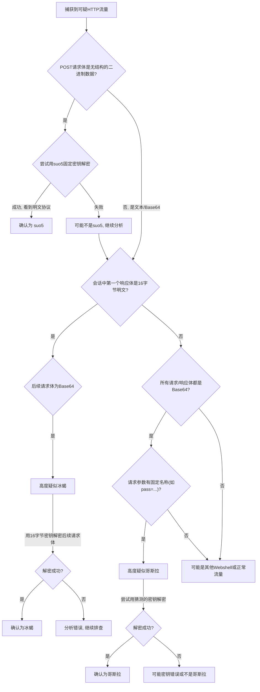

# Webshell 流量分析 v1.0

这是一个使用 Python 和 Tkinter (ttkbootstrap) 开发的图形化工具，旨在帮助快速解密和分析三种常见Webshell（suo5、哥斯拉、冰蝎）的网络流量。

---

## 目录
[toc]

---

## 使用方法

#### 快速启动
本工具会打包为独立的可执行文件。
1.  文件解压后，直接双击运行exe程序即可。

---

## 功能说明

工具界面通过选项卡分隔不同类型的Webshell及其功能。

### 1. suo5 分析

#### suo5 PCAP 分析
- **作用**: 自动从一个`.pcap`流量包中提取所有`suo5`的HTTP流量，解密其中的指令和执行结果，并将分析报告保存为 Excel (`.xlsx`) 文件。
- **使用方法**:
  1. 在 `suo5 PCAP 分析` 选项卡中，点击"选择文件..."按钮或直接将`.pcap`文件拖拽到指定区域。
  2. 文件选择后，"开始分析"按钮将被激活。
  3. 点击"第二步: 开始分析"按钮。
  4. 分析过程将在后台执行，日志会实时显示在下方的"分析日志"区域。
  5. 分析完成后，会自动在项目根目录下生成一个名为 `suo5_analysis_report_YYYYMMDD_HHMMSS.xlsx` 的报告文件。

#### suo5 载荷解密
- **作用**: 快速解密单条`suo5`加密的十六进制（Hex）字符串。
- **使用方法**:
  1. 切换到 `suo5 载荷解密` 选项卡。
  2. 将从流量中复制的十六进制加密载荷粘贴到输入框中。
  3. 点击"解密"按钮。
  4. 解密结果会立即显示在下方的"解密结果"区域。

### 2. 哥斯拉 (Godzilla) 分析

#### 哥斯拉 PCAP 分析
- **作用**: 分析包含哥斯拉 v3/v4 流量的`.pcap`文件，根据提供的密码、URI和加密器类型，解密所有指令和结果，并生成Excel报告。
- **使用方法**:
  1. 切换到 `哥斯拉 PCAP 分析` 选项卡。
  2. **第一步**: 点击"选择文件..."按钮选择`.pcap`文件。
  3. **第二步**: 填写`Webshell`的详细信息：
     - **连接密码 (Key)**: Webshell的连接密码。
     - **Webshell URI**: Webshell文件的URI路径 (例如: `/shell.jsp`)。
     - **加密器类型**: 根据目标Webshell的版本选择正确的加密器 (`AES_BASE64` 或 `XOR_BASE64` 等)。
  4. **第三步**: 点击"开始分析"按钮。
  5. 分析完成后，会自动在项目根目录下生成 `godzilla_analysis_report_YYYYMMDD_HHMMSS.xlsx` 报告。

#### 哥斯拉载荷解密
- **作用**: 解密单条哥斯拉的加密载荷。
- **使用方法**:
  1. 切换到 `哥斯拉载荷解密` 选项卡。
  2. 输入**连接密码**并选择正确的**加密器类型**。
  3. 将加密的载荷（通常是Base64格式）粘贴到输入框。
  4. 点击"解密"按钮，结果将显示在下方。

### 3. 冰蝎 (Behinder) 分析

#### 冰蝎 PCAP 分析
- **作用**: 自动分析冰蝎 v3/v4 的流量，通过模拟客户端握手从流量中提取动态会话密钥，然后用该密钥解密后续的所有加密通信，并生成Excel报告。
- **使用方法**:
  1. 切换到 `冰蝎 PCAP 分析` 选项卡。
  2. **第一步**: 选择包含冰蝎流量的`.pcap`文件。
  3. **第二步**: 输入Webshell的**连接密码**（用于完成密钥协商）。
  4. **第三步**: 点击"开始分析"按钮。
  5. 分析完成后，会自动在项目根目录下生成 `behinder_analysis_report_YYYYMMDD_HHMMSS.xlsx` 报告。

#### 冰蝎载荷解密
- **作用**: 解密单条冰蝎的加密载荷。
- **使用方法**:
  1. 切换到 `冰蝎载荷解密` 选项卡。
  2. **输入动态会话密钥**:
     - **重要提示**: 这里需要填写的不是Webshell的连接密码，而是从流量中捕获到的、经过Base64编码的16字节动态会话密钥。此密钥在每次会话中都不同，通常可以在PCAP分析报告中找到。
  3. 将加密的载荷（Base64格式）粘贴到输入框。
  4. 点击"解密"按钮，查看结果。

---

## 实战分析：如何识别并解密未知Webshell流量

当你捕获到一段可疑的Web服务器流量时，可以遵循以下步骤来甄别它是否为`suo5`、`哥斯拉`或`冰蝎`的流量，并进行解密。这是一个从特征识别到确认的通用分析流程。

### 第一步：初步筛选与流量过滤

1.  **协议过滤**: 在 Wireshark 中，首先使用过滤器 `http.request` 或 `tls.handshake.type == 1` 来分别筛选 HTTP 或 HTTPS 流量。Webshell 主要通过这些协议进行通信。对于加密流量，你需要有能力解密（例如，拥有服务器私钥或使用中间人代理）。
2.  **寻找可疑目标**:
    *   **异常的脚本文件**: 重点关注对不常见的 `.php`, `.jsp`, `.aspx` 等脚本文件的 `POST` 请求，特别是那些文件名随机（如 `x.php`）或伪装成正常文件（如 `jquery.jsp`）的请求。
    *   **请求与响应体大小**: Webshell 在执行命令时，请求体和响应体通常都较大，且大小不固定，这与正常的 API 调用不同。
    *   **无用户交互的大量流量**: 如果一个页面持续产生大量没有明显用户前端行为的 `POST` 流量，这可能是 Webshell 的心跳或数据传输。
    *   **检查请求头**: 检查 `User-Agent`, `Accept`, `Content-Type` 等请求头。很多 Webshell 会使用固定的、非浏览器默认的请求头，例如 `Java/1.8.0_121` 或缺失某些常见浏览器头部。

### 第二步：根据流量特征进行甄别（决策树）

#### 1. 是否为冰蝎 (Behinder)？（最优先排查）

冰蝎的**动态密钥协商**是其最显著的特征，因此我们应该优先尝试寻找这个行为。

*   **核心特征**: 动态密钥协商。冰蝎的流量模型是"一次明文响应，全程密文通信"。
*   **识别流程**:
    1.  **定位会话**: 在 Wireshark 中，右键点击一个可疑的 HTTP `POST` 请求，选择 "Follow" -> "TCP Stream" 或 "HTTP Stream"。
    2.  **寻找密钥交换**: 在会话的**第一个**数据包中，检查**服务器的响应体 (Response Body)**。
        *   **黄金法则**: 如果该响应体的内容**正好是 16 个字节的明文**，并且后续所有的数据包（无论请求还是响应）都变成了长串的 Base64 编码字符串，那么**几乎可以100%确认是冰蝎**。
        *   这 16 字节的数据就是本次通信的 **AES 会话密钥**。
    3.  **验证解密**: 复制这个16字节的会话密钥和后续任意一个请求体中的Base64字符串，使用 CyberChef 进行验证。如果能解密出结构化的数据（如序列化的指令），则完成确认。

#### 2. 是否为`suo5`隧道？

*   **核心特征**: 无结构化的二进制隧道代理。
*   **识别流程**:
    1.  **请求/响应体**: 观察 `POST` 请求的 Body 部分。如果它看起来是完全随机、无结构的二进制数据流，而不是文本或 Base64，则有 `suo5` 的嫌疑。
    2.  **固定加密**: `suo5` 使用固定的 XOR 加密。你可以编写一个简单的脚本，用已知的 `suo5` 协议密钥去尝试解密请求体。
    3.  **确认**: 如果解密后能看到清晰的另一层协议数据（例如，明文的 `SSH-2.0...` Banner，或者 RDP 协议的握手信息），则可以确认是 `suo5`。

#### 3. 是否为哥斯拉 (Godzilla)？

如果在流量中找不到冰蝎和`suo5`的明显特征，则应怀疑是哥斯拉。

*   **核心特征**: 全程加密，无明文交互。
*   **识别流程**:
    1.  **流量模式**: 找到一个目标 URI，其所有 `POST` 请求和响应的 Body **全部都是**看似 Base64 编码的长字符串。没有像冰蝎那样的"明文响应 -> 密文请求"的转变过程。
    2.  **HTTP请求细节**:
        *   **请求参数**: 观察 `POST` 请求的 Body。默认情况下，哥斯拉的请求体是通过一个固定的参数名来传递加密载荷的。例如，默认的密码是 `pass`，那么请求体可能就是 `pass=aW1wb3J0I...` 的形式。这个参数名是确认哥斯拉的重要辅助特征。
        *   **请求头**: 检查 `Accept` 请求头。默认情况下，Java 版的哥斯拉会带有 `Accept: text/html, image/gif, image/jpeg, *; q=.2, */*; q=.2` 这样的默认值，这是 Java 环境的典型特征。
    3.  **响应体特征**: 哥斯拉的响应体也是加密的 Base64。一个显著特征是，默认配置下，解密后的响应体**开头和结尾各有一个16字节的MD5哈希值**，用于校验数据完整性。
    4.  **确认（需要密钥）**: 与冰蝎不同，要100%确认哥斯拉流量，**必须知道其密码和密钥**。如果高度怀疑是哥斯拉，可以尝试使用常见的弱口令（如 `pass`, `key`, `admin`, `shell`）和默认密钥 (`key`)进行解密。如果能解出有意义的数据，则完成确认。

### 第三步：总结与流程图

---

## 技术依赖

本工具主要依赖以下Python库：
- `ttkbootstrap`: 用于实现美观的现代化GUI界面。
- `scapy`: 强大的网络数据包处理库，用于解析PCAP文件。
- `openpyxl`: 用于创建和写入 Excel (.xlsx) 文件。
- `pycryptodome`: 提供AES等加密算法支持，用于解密流量。
- `tkinterdnd2`: 为Tkinter提供拖拽功能支持。
- `Pillow`: 用于处理和加载图标文件。 

## 技术原理与手动分析

本工具支持对三种常见的Webshell流量进行解密与分析，包括`suo5`、`哥斯拉(Godzilla)`和`冰蝎(Behinder)`。下面将详细介绍它们的工作原理、流量特征以及如何手动进行分析。

### 1. `suo5` 隧道

`suo5` 是一个经典的基于HTTP代理的隧道工具，常被用作Webshell的通信隧道。它的主要特点是原理简单、加密薄弱，但流量形态较为固定。

#### 技术原理与流量特征

- **通信协议**：`suo5` 通过HTTP `POST` 请求来建立和维持一个TCP隧道。客户端将需要代理的数据通过`POST`请求发送给服务器端的Webshell脚本。
- **加密方式**：它采用了一种非常基础的**逐字节XOR（异或）加密**。加密密钥是固定的，并且通常与数据包的长度存在关联。这种加密强度很低，很容易被破解。
- **流量特征**：
  - 所有通信都封装在HTTP `POST`请求中。
  - 请求体是经过XOR加密的二进制数据，没有可读的明文。
  - 建立连接后，`suo5`会在客户端和真实目标服务器之间建立一个TCP代理隧道。解密后的流量可以看到完整的TCP通信内容，例如SSH、RDP等协议的流量。

#### 手动解密与分析

由于`suo5`的加密方式是固定的逐字节XOR，手动分析通常需要编写简单的脚本来完成解密。

1.  **定位流量**: 找到发送给`suo5` Webshell的HTTP `POST`请求。
3.  **提取载荷**: 从`POST`请求的Body中提取出十六进制（Hex）格式的加密载荷。
4.  **编写脚本解密**: 使用Python等语言，根据`suo5`的开源代码实现其XOR解密算法。核心逻辑是使用一个固定的密钥对载荷进行逐字节异或操作。
5.  **分析明文**: 解密后的数据就是原始的TCP隧道内容，可以进一步分析其内部传输的真实协议和指令。

### 2. 哥斯拉 (Godzilla) Webshell

哥斯拉是一款功能强大的模块化Webshell，以其灵活的加密和"内存马"技术著称，相比`suo5`更加隐蔽。

#### 技术原理与流量特征

- **通信协议**：哥斯拉的通信完全通过HTTP `POST`请求完成。其核心思想是"一次载入，多次调用"。
- **加密方式**：哥斯拉支持多种加密器，最常见的是 **`AES/CBC/PKCS5Padding`** 加密，部分版本也支持`XOR`加密。
  - **密钥派生**：通信的AES密钥通常由用户设定的`key`（默认为"key"）计算其MD5哈希，再取哈希值的前16个字节作为AES密钥。
- **流量特征**：
  - **动态载荷注入 (内存马)**：哥斯拉的显著特征是其"内存马"行为。在建立连接的第一个请求中，客户端会将一个包含所有核心功能（如文件管理、命令执行）的完整PHP/JSP/ASPX类（称为`payload`）加密后发送给服务器。服务器端的Webshell接收到后，会将其存储在`Session`中。
  - **后续通信**：后续的所有操作，客户端仅需发送简短的指令（如`methodName=test`），调用`Session`中已加载的`payload`类来执行，从而避免在磁盘上留下大量恶意文件。
  - **请求与响应**：所有请求和响应的Body部分都是经过**AES加密 + Base64编码**的密文，无法直接读取。部分版本还会在响应体两端拼接MD5值作为校验。

#### 手动解密与分析

手动分析哥斯拉流量的前提是**必须知道生成Webshell时所使用的密码（pass）和密钥（key）**。

2.  **推导AES密钥**: 根据哥斯拉的源码，AES密钥是由用户设置的`key`计算其MD5哈希，再取其前16位（字节）生成。例如，默认`key`为"key"，其MD5值为`3c6e0b8a9c15224a9d49959954694900`，因此AES密钥为`3c6e0b8a9c15224a`。
3.  **提取加密载荷**: 从`POST`请求的Body中找到加密数据。通常，数据是以`pass=...`的形式存在，需要提取等号后面的Base64编码字符串。
4.  **使用工具解密**:
    *   **推荐工具**: CyberChef。
    *   **解密步骤**:
        a. 将提取的Base64载荷拖入CyberChef。
        b. 添加 "From Base64" 操作。
        c. 添加 "AES Decrypt" 操作。
        d. 在 "AES Decrypt" 中，填入第2步推导出的16字节密钥，将IV设置为空，模式选择`CBC`，输入和输出格式均为`Hex`。
5.  **分析明文**: 解密后的结果就是原始的PHP/JSP/ASPX代码或指令。第一次连接的载荷是完整的`payload`功能代码，后续连接则是简短的指令。

### 3. 冰蝎 (Behinder) Webshell

冰蝎是目前最流行和最隐蔽的Webshell之一，其核心优势在于创新的**动态密钥协商机制**，使得每次会话的加密密钥都不同，极大地增加了流量检测和分析的难度。

#### 技术原理与流量特征

- **通信协议**：冰蝎的通信分为两个阶段：密钥协商和加密通信。
- **加密方式**：主要使用 **`AES/CBC/PKCS5Padding`** 对称加密。
- **流量特征**：
  1.  **阶段一：密钥协商 (Handshake)**
      *   客户端向Webshell地址发起第一个HTTP请求（通常是`GET`或`POST`）。这个请求**不包含任何加密数据**。
      *   服务器端Webshell脚本在收到此请求后，会**随机生成一个16字节的AES密钥**。
      *   Webshell将这个新生成的密钥直接在**响应体（Response Body）中明文返回**，并将其存储在服务器的`Session`中，作为本次会话的**会话密钥**。
      *   这个返回明文密钥的响应是冰蝎流量最关键的识别特征。
  2.  **阶段二：加密通信 (Encrypted Communication)**
      *   客户端收到会话密钥后，后续所有发送给服务器的指令都会使用该密钥进行`AES`加密，然后进行`Base64`编码，通过`POST`请求发送。
      *   服务器端从`Session`中读取之前存储的会话密钥，解密收到的数据并执行。
      *   执行结果同样使用该会话密钥加密并编码后返回给客户端。

#### 手动解密与分析

冰蝎的动态密钥协商机制使得手动分析成为可能，即使不知道Webshell的连接密码。核心是找到密钥协商的过程。

1.  **定位会话**: 通过`http.request.method == "POST"`和Webshell的URL路径来定位可疑的HTTP会话。
2.  **寻找密钥协商**: 在定位到的HTTP会话中，寻找**第一个**请求。这个请求的**响应体（Response Body）** 中会包含一个16字节的明文字符串，这就是本次会话的AES密钥。这是最关键的一步。
3.  **提取加密载荷**: 在找到会话密钥之后，该会话后续所有的`POST`请求和响应的Body都是`AES`加密并经过`Base64`编码的密文。
4.  **使用工具解密**:
    *   **推荐工具**: CyberChef (或[在线AES解密工具](http://tools.bugscaner.com/cryptoaes/))。
    *   **解密步骤**:
        a. 将后续请求中的Base64密文载荷复制到CyberChef。
        b. 添加 "From Base64" 操作。
        c. 添加 "AES Decrypt" 操作。
        d. 在 "AES Decrypt" 中，填入第2步获取的16字节**会话密钥**，将IV设置为空，模式选择`CBC`，输入和输出格式均为`Hex`。
5.  **分析明文**: 解密后的结果就是客户端发送的真实指令（通常是序列化的PHP代码）或服务器返回的执行结果。

## 使用入门

本工具的使用非常简单，只需按照以下步骤操作即可：

1. 打开工具，选择要分析的Webshell类型。
2. 根据提示选择要分析的流量文件或输入相关信息。
3. 点击"开始分析"按钮，工具将自动完成分析过程。
4. 分析完成后，结果将显示在工具界面的相应区域。

希望本工具能够帮助您快速、准确地分析Webshell流量，提高网络安全防护能力。 